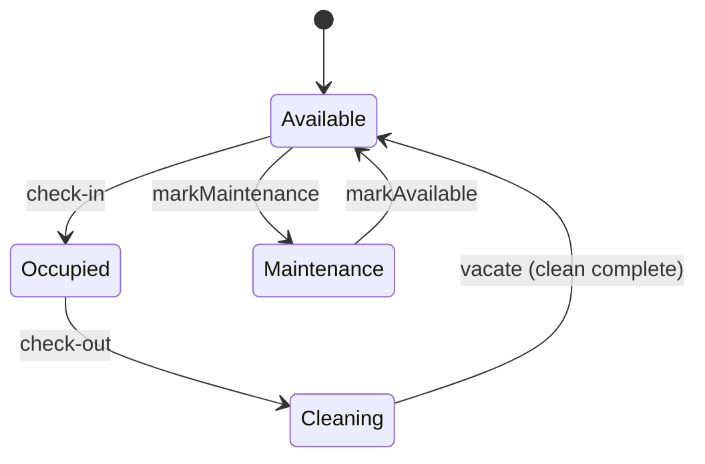
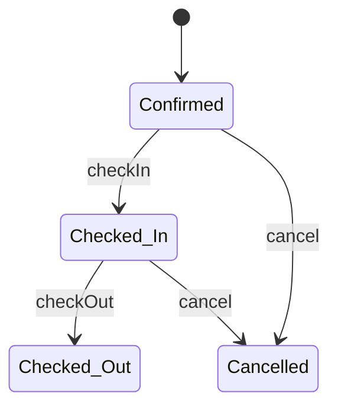
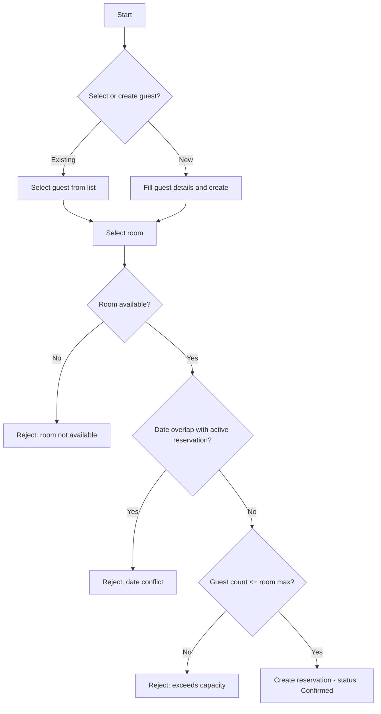
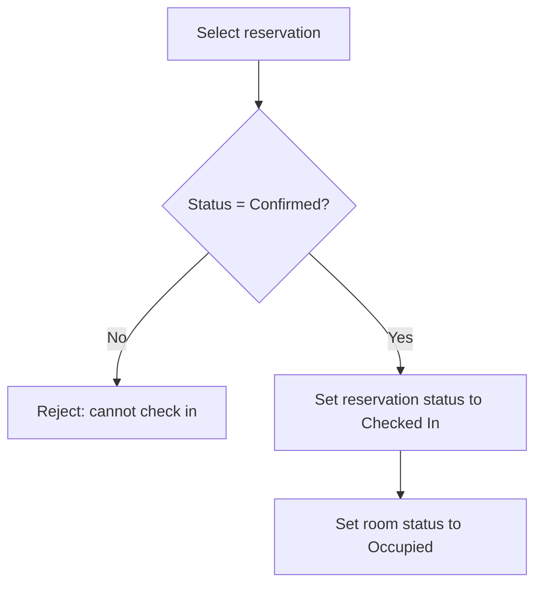
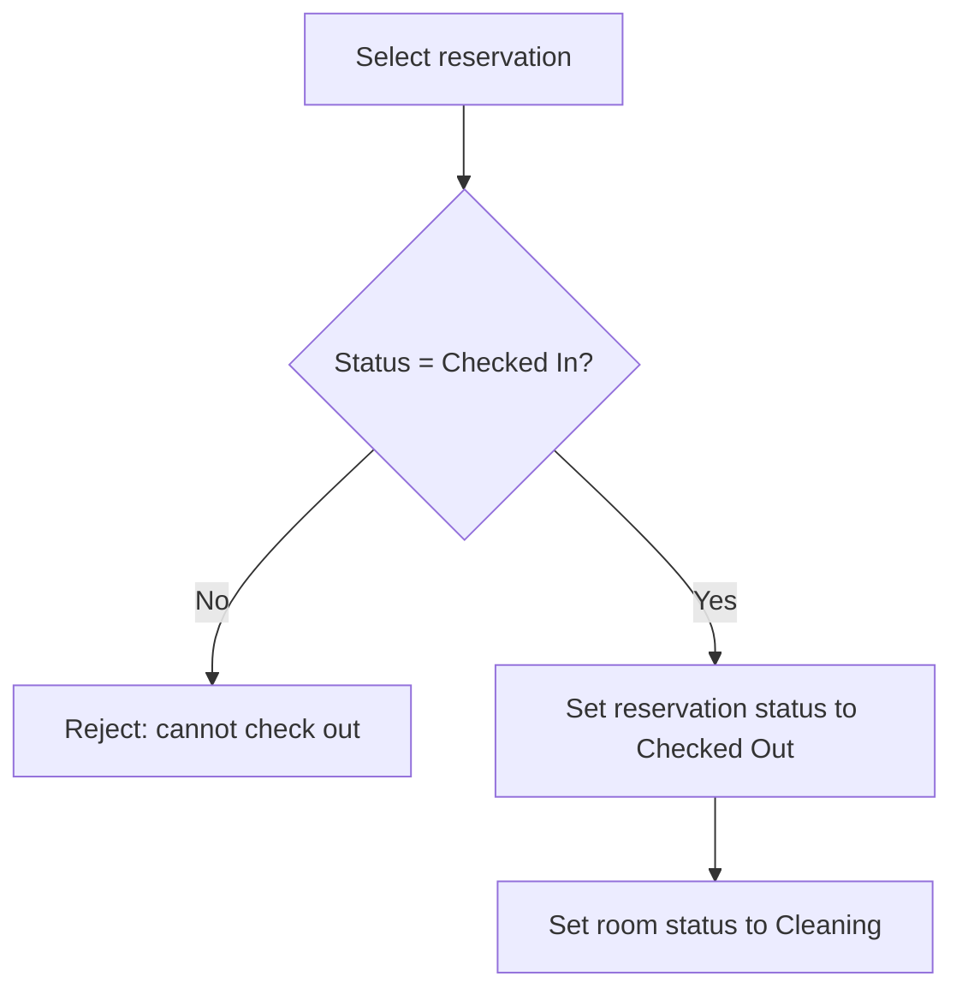
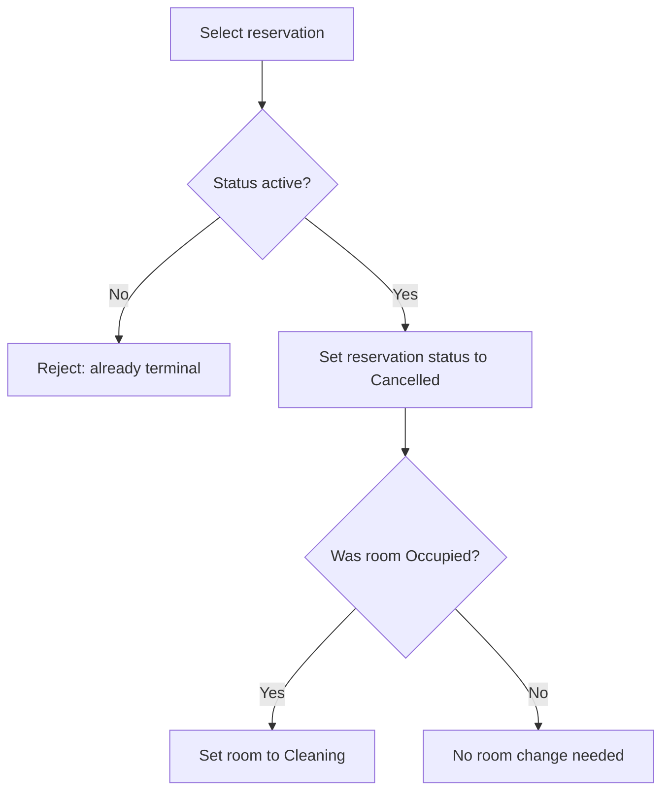

# Logic Flows

Consult these diagrams before implementing or modifying any action flow. Every state transition and multi-step operation must respect these rules.

## Room State Machine

- An occupied room cannot be booked or put into maintenance.
- A room must pass through Cleaning before becoming Available again after checkout.

## Reservation State Machine

- Only active reservations (Confirmed or Checked In) block availability.
- Cancelled and Checked Out are terminal states.

## Reservation Creation Flow

## Check-In Flow

## Check-Out Flow

## Cancellation Flow

