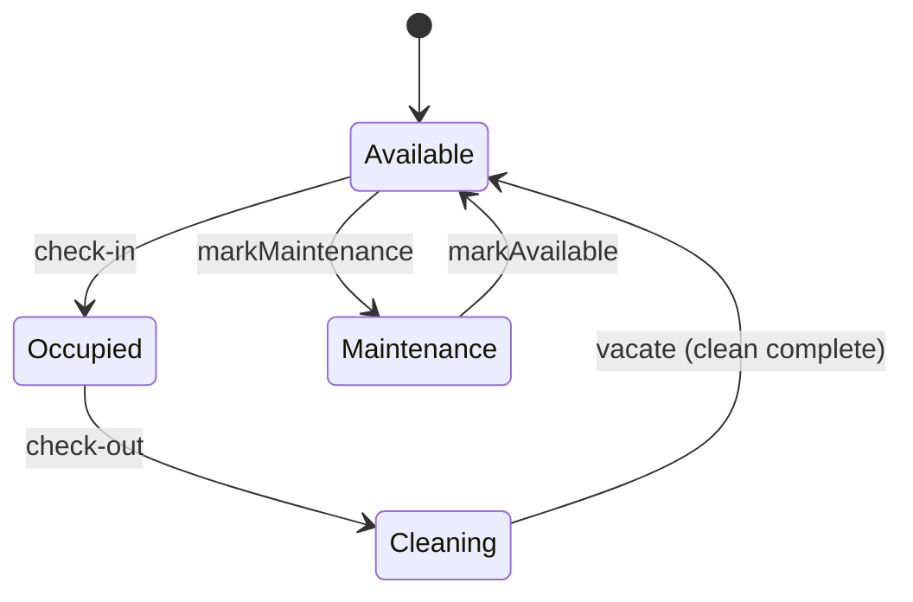
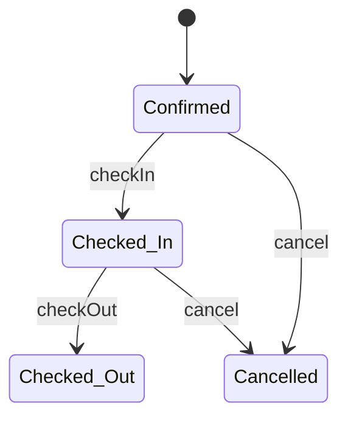
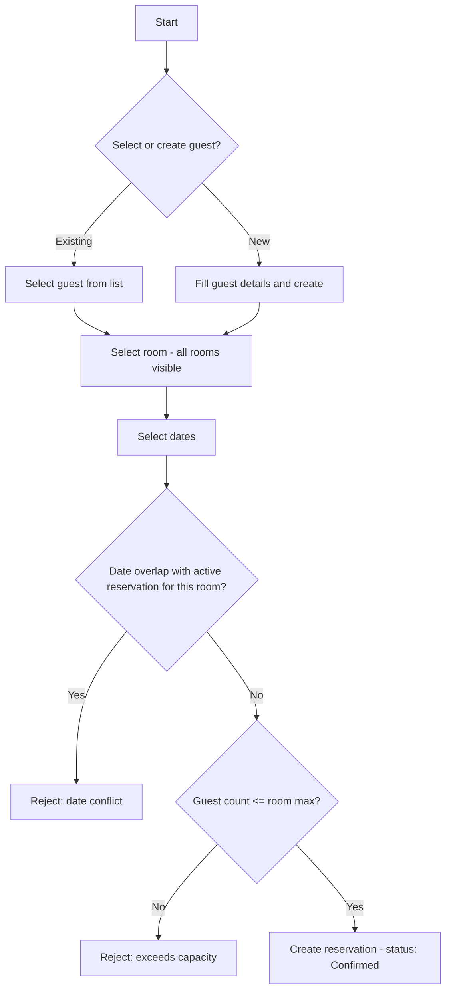
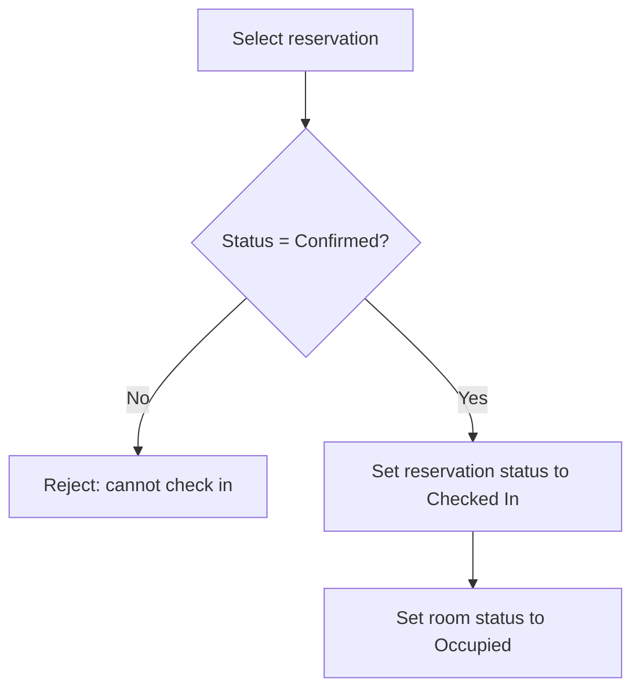
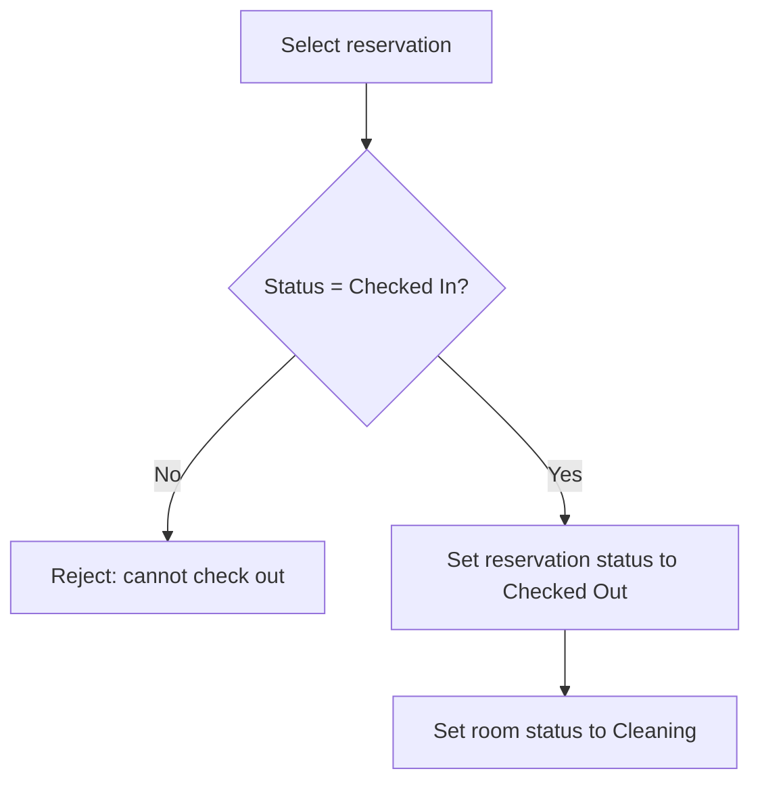
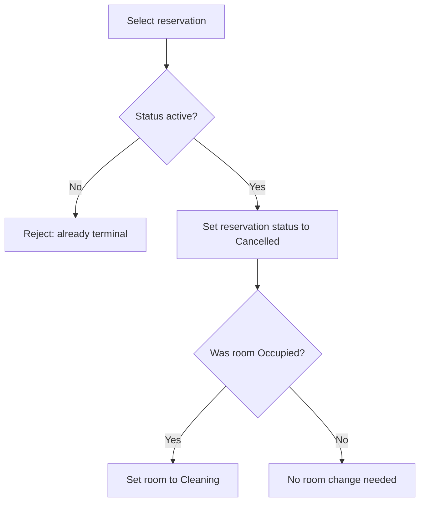
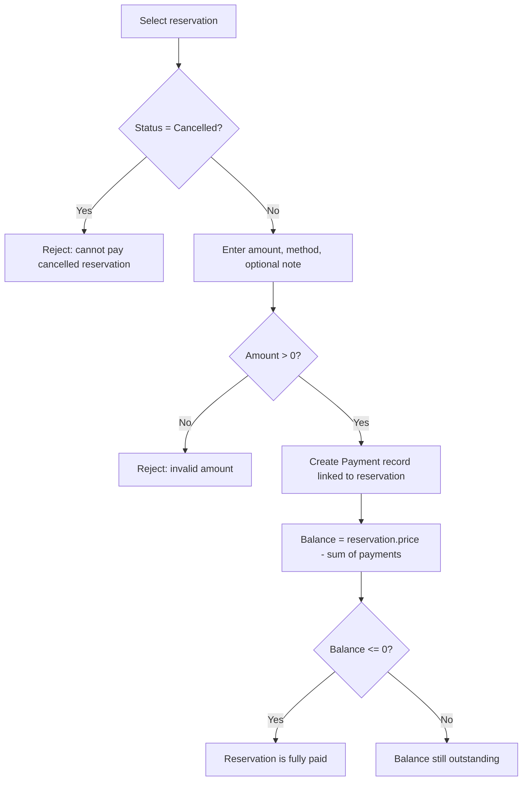
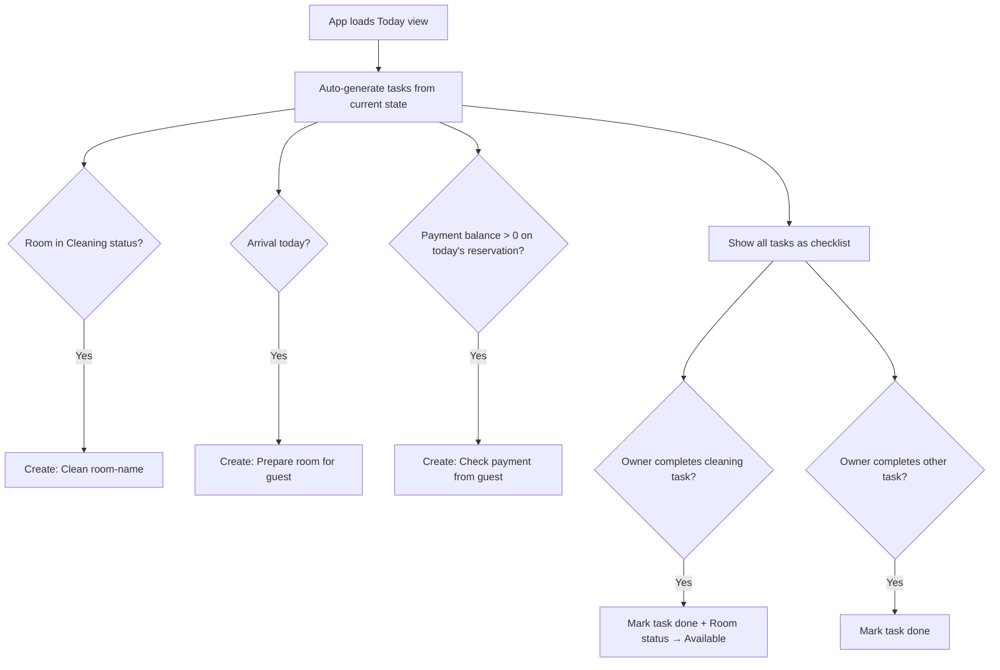

# Logic Flows

Consult these diagrams before implementing or modifying any action flow. Every state transition and multi-step operation must respect these rules.

## Room State Machine

- An occupied room cannot be booked or put into maintenance.
- A room must pass through Cleaning before becoming Available again after checkout.

## Reservation State Machine

- Only active reservations (Confirmed or Checked In) block availability.
- Cancelled and Checked Out are terminal states.

## Reservation Creation Flow

- All rooms are shown regardless of current status, since a reservation can be for future dates after the current guest checks out.

## Check-In Flow

## Check-Out Flow

## Cancellation Flow

## Payment Flow

- Payments are a separate entity linked to a reservation via `reservationId`.
- Multiple partial payments are allowed until balance reaches zero.
- Payments can be recorded from: Guest detail view, Calendar reservation detail.
- Payment methods: `cash`, `card`, `transfer`.

## Task Flow

- Auto-generated tasks are idempotent: they use deterministic IDs (`auto-clean-{roomId}-{date}`) so they are not duplicated on refresh.
- Completing a cleaning task automatically transitions the room from Cleaning → Available.
- Manual tasks can be created by the owner with a title and category (cleaning, preparation, payment, communication, custom).
- Tasks are scoped to a single day.
